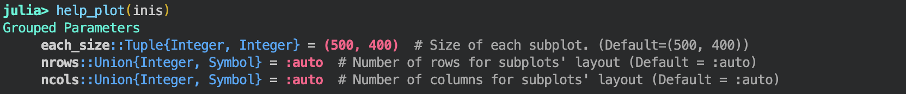
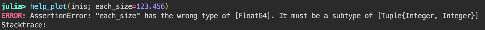

# HelpPlots.jl

[](https://github.com/mgyoo86/HelpPlots.jl/actions/workflows/CI.yml?query=branch%3Amain)

## About the Package

`HelpPlots.jl` provides simple utilities to enhance the `@recipe` functionality in `Plots.jl`. It checks the correctness of keyword arguments and displays helpful information so that users can fine-tune their plots. This functionality was originally developed by **Orso Meneghini** and has been extracted into a lightweight, standalone package.

## Note

This package is designed to be independent and lightweight, without strict dependencies on other packages (e.g., it is independent of the `FUSE.jl` ecosystem). However, to use the `help_plot` and `help_plot!` functionalities provided by `HelpPlots.jl`, users must also load the `Plots.jl` package.

## Examples
One can define keyword information inside `@recipe` using `assert_type_and_record_argument` function provided by `HelpPlots.jl` package, like the following example:
```julia
using HelpPlots

# FYI, this recipe is defined in `SimulationParameters.jl` package
@recipe function plot_GroupedParameters(GPs::Vector{GroupedParameter}; nrows=:auto, ncols=:auto, each_size=(500, 400))

    name = "Grouped Parameters"
    assert_type_and_record_argument(name, Tuple{Integer,Integer}, "Size of each subplot. (Default=(500, 400))"; each_size)
    assert_type_and_record_argument(name, Union{Integer,Symbol}, "Number of rows for subplots' layout (Default = :auto)"; nrows)
    assert_type_and_record_argument(name, Union{Integer,Symbol}, "Number of columns for subplots' layout (Default = :auto)"; ncols)

    # Main body of recipe
    ...
    ...
    @series begin
        ...
        ...
    end
end
```

The following examples illustrate how `help_plot` works. See `test/runtests.jl` and `test/my_recipes.jl` for more details.

```julia
# Suppose you have some data and an associated @recipe.
# The following example assumes that you have `inis` and `inis2` as your data,
# and that you are using an @recipe defined in the `SimulationParameters.jl` package.

# This will plot the figure and display the available keyword information.
help_plot(inis)

# This will overlay on the current figure and display the available keyword information.
help_plot!(inis2)
```

The keyword information is printed like the following.
<br />
<div align="center">
    
</div>
<br />

The help_plot function checks the validity of keyword arguments and informs the user if a given keyword is incorrect.
For example:
```julia
# The following call will fail because `each_size` is expected to be a Tuple{Integer, Integer}
help_plot(inis, each_size=123.456)

```
In such a case, `help_plot` produces an error message to guide the user in fixing the keyword.

<br />
<div align="center">
    
</div>
<br />
